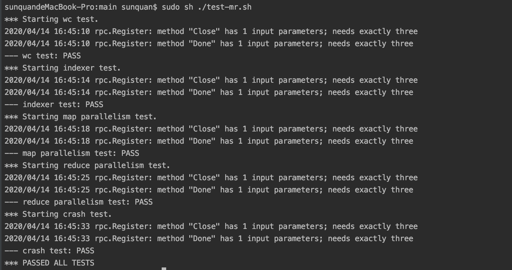

# Lab1 实现一个MapReduce框架
## 0.运行一个顺序执行的 **mapreduce** 例子体验一下程序逻辑
 ```bash
cd src/main
// 将用户自定义的函数编译为动态连接库来执行
go build -buildmode=plugin ../mrapps/wc.go
rm mr-out*
go run mrsequential.go wc.so pg*.txt
more mr-out-0
 ```
## 1. 如何启动一个分布式的 **mapreduce**？
### 启动一个 master
```bash
cd src/main
go build -buildmode=plugin ../mrapps/wc.go
rm mr-out*
go run mrmaster.go pg-*.txt
```
###  启动多个 worker
打开多个终端 进入到项目的`main`下执行`go run mrworker.go wc.so`
     
## 2. 完成实验
###  编码
1. 在 `src/mr` 目录下完成实验内容
2. `mrmaster.go`会调用你编写的 `src/mr/master.go`代码
3. `mrworker.go`会调用`src/mr/worker.go`的代码
4. 二者通信的代码在`src/mr/rpc.go`中自行实现
5. 我已经完成了实验代码,在`src/mroriginal`目录下有原始的实验框架是我留给你来独立完成的
6. 将mr文件夹进行覆盖即可:`mv src/mroriginal src/mr` 或者备份下留作参考😁

**ps:在`src/mrapps`目录下的是**MR**相关的应用函数**
 
### 调试
通过与`cat mr-out-* | sort` 输出的结果来对比可以检查你编写的MR框架是否运行正确

### 测试
在 `src/main`目录下执行 `sh test-mr.sh`由于master程序默认永远不退出,脚本执行后注意 `killall mr*` 释放掉资源.

## 更多Lab1实验的内容
[请点击这里](http://nil.csail.mit.edu/6.824/2020/labs/lab-mr.html)

## 通过截图


## 总结
1. 虽然通过了全部测试,但是感觉还有很多地方没有完善 例如
    1. reduce过程没有使用外部排序,仅在内存中完成
    2. 没有进行优雅关闭的处理,当完成所有任务后,并没有将master资源进行释放
    3. worker节点没有处理响应的返回码以一种粗暴的方式进行关闭
2. 整体实验中学到最多的就是在设计之初没有思考清楚资源管理导致后来很难进行管理

## TODO
- [ ] 完成job后合理的释放资源

- [ ] worker与master的通信异常状态处理

- [ ] 优雅关闭整个集群

- [ ] 发展为生产级别的嵌入式MapReduce计算框架
